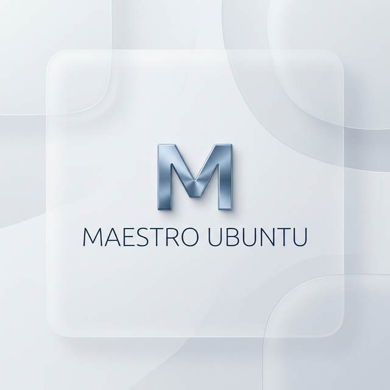
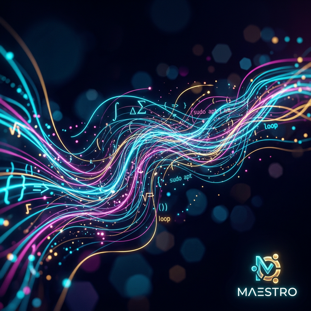
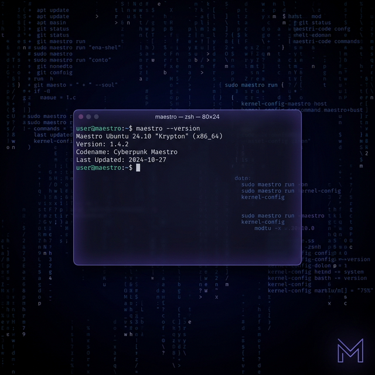

# Maestro Ubuntu

[](https://github.com/Of-Arte/maestro-ubuntu/actions/workflows/ci.yml)
[](LICENSE)

A tiered, automated development environment for Ubuntu 24.04 LTS. Built for [Maestro AI Software Engineering](https://github.com/Of-Arte) students who need a stable Linux environment on VirtualBox (Windows, macOS, or existing Linux).

Install only what the current term requires. Same tools, same CLI, same curriculum as the Maestro Omarchy ISO — just on Ubuntu instead of Arch.

---

## Prerequisites

- **OS**: Ubuntu 24.04 LTS (Noble Numbat) — no other versions supported
- **RAM**: 4 GB minimum, 8 GB recommended
- **Disk**: 20 GB minimum
- **Network**: Required during install

---

## Quickstart

```bash
curl -sS https://raw.githubusercontent.com/Of-Arte/maestro-ubuntu/main/install.sh | bash
```

This installs the **Base Tier** and drops a `maestro` CLI on your PATH.

### Manual install

```bash
sudo apt update && sudo apt install -y git
git clone https://github.com/Of-Arte/maestro-ubuntu.git
cd maestro-ubuntu
chmod +x install.sh
./install.sh
```

---

## Tiers

| Tier | Command | When | What's included |
|---|---|---|---|
| **Base** | _(installed automatically)_ | Terms 1–2 | Python 3.12, Node 20, Docker, Zsh, git, uv, pnpm, oh-my-zsh |
| **Web** | `maestro install web` | Term 3+ | TypeScript, Vite, FastAPI, Postgres, Redis, MongoDB, DBeaver, Playwright |
| **AI** | `maestro install ai` | Term 7+ | PyTorch, scikit-learn, LangChain, Ollama, Jupyter, ChromaDB, HuggingFace |

Install tiers in order. Each is idempotent — safe to run again.

---

## CLI Reference

```bash
maestro validate          # smoke test the current installation
maestro install web       # install the web tier
maestro install ai        # install the AI tier
maestro uninstall         # remove Maestro CLI and settings
maestro version           # print the stack version
```

---

## Repo Structure

```
maestro-ubuntu/
├── install.sh              # entry point — installs base tier, creates maestro CLI
├── validate.sh             # smoke tests per tier
├── uninstall.sh            # removes Maestro CLI and settings
├── tiers/
│   ├── base.sh             # Terms 1–2 stack
│   ├── web.sh              # Terms 3–6 stack
│   └── ai.sh               # Terms 7–9 stack
├── stack/
│   ├── apt.txt             # apt packages (base tier)
│   ├── runtime.versions    # pinned runtime versions
│   └── pip.txt             # Python packages
├── vm/
│   ├── build-ova.sh        # exports a VirtualBox .ova from a running VM
│   └── Vagrantfile         # Vagrant wrapper for automated provisioning
└── desktop/
    ├── keybinds.md         # GNOME keyboard reference for students
    └── maestro-welcome.sh  # first-login greeting
```

---

## Design Principles

- **Idempotent**: every script is safe to run twice
- **Pinned**: all versions locked in `stack/runtime.versions`
- **Tiered**: install only what the current term requires
- **No credentials**: zero private keys, tokens, or hardcoded usernames
- **No prompts**: fully automated, unattended installs only
- **Fail fast**: `set -euo pipefail` in every script

---

## Contributing

See [CONTRIBUTING.md](CONTRIBUTING.md).

---

## Wallpapers & Visuals

The distribution includes a pack of high-definition wallpapers located in `desktop/assets/`.

| [Base Tier](desktop/assets/maestro_wallpaper_light.png) | [Web Tier](desktop/assets/maestro_marketing_abstract.png) | [AI Tier](desktop/assets/maestro_terminal_aesthetic.png) |
|:---:|:---:|:---:|
|  |  |  |
| A clean, professional **Light Mode** variant for bright environments. | High-impact **Abstract** branding for marketing and presentations. | A focused, code-centric **Terminal Aesthetic** for power users. |

---

## Future Roadmap

- **Tier-Specific UI Themes**: Automatically apply unique visual themes (wallpapers, terminal colors, etc.) based on the active tier.
  - **Base Tier**: Minimalist / Clean
  - **Web Tier**: Vibrant / Dynamic
  - **AI Tier**: Cyber-Noir / Matrix-style
- **Browser Profiles**: Pre-configured profiles for Firefox/Brave with relevant dev extensions per tier.

---

## License

[MIT](LICENSE) — © 2026 Of-Arte
